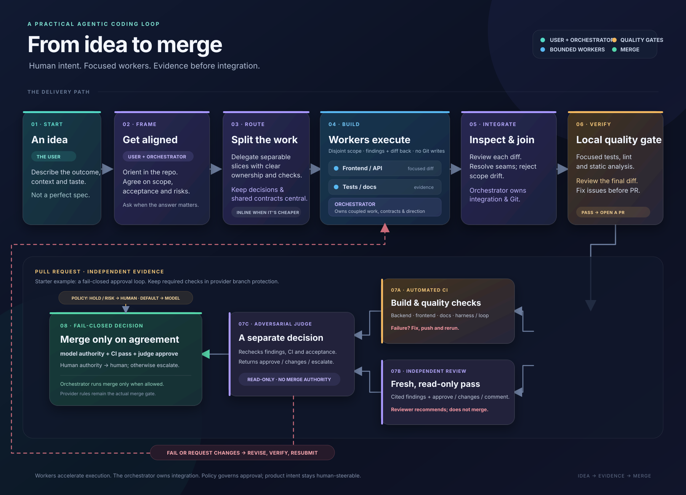

# Agentic Approach

A living playbook for agentic coding, plus a ready-to-use starter you can build a real project from.

The playbook (`guide/`) extracts what actually works in real projects, generalizes it, and points at a
complete starter (`app/`) that already has the workflow, agents, checks, and CI wired — so you start
from a working setup instead of assembling one by hand.

**[Visit the website](https://mbmjava.github.io/agentic-approach/)** · [Explore the playbook](guide/README.md) · [Use the starter](app/)

[Open or download the workflow visual](guide/coding-flow.svg).

## Start here

- **New to agentic coding:** [What this is](guide/what-this-is.md) → [Playbook](guide/playbook.md) →
  [Roles](guide/agentic-workflow.md) → [Safe delegation](guide/delegate-safely.md).
- **Setting up a project:** [Bootstrap checklist](guide/bootstrap-checklist.md),
  [working agreement](guide/working-agreement.md), [template](guide/agentic-coding-template.md), and an
  adapter ([OpenCode](guide/configure-opencode.md) or [Claude Code](guide/claude-code-setup.md)).
- **Starting from this repo:** copy the **`app/`** directory into your project (or use this repo as a
  template) — it carries the harness, docs, templates, and CI. See
  [Bring the playbook into a project](guide/bring-playbook-to-project.md).
- **Full topic index:** [guide/README.md](guide/README.md).

## What's in here

| Path | What it is |
| --- | --- |
| `guide/` | the playbook — plain GitHub-flavored Markdown with relative links |
| `site/` | the Tailwind-powered public site and reader for the playbook and starter docs, deployed with GitHub Pages |
| `app/` | the complete, self-contained starter: a blank Maven + React app plus its harness (`.opencode/`, `.claude/`, `scripts/`, `docs/`, `working-docs/`, `tools/`, `.github/`) and its own `AGENTS.md` |
| `working-docs/` | maintenance plans and notes for this playbook and starter; may also hold non-actionable adoption references |
| `scripts/` | repo-level checks for the playbook (link check) |
| `.github/` | CI for this repo (guide links + the starter's checks) |

## How the guide stays real

Every claim is either a tested lesson or is labelled with its limits (dated estimates, prices, results).
The playbook follows the practice, not the other way around. See [What this is](guide/what-this-is.md)
and the [working agreement](guide/working-agreement.md).

This repository owns the framework and its starter, not the application code of projects that adopt or
inspire it. External repositories are references by default; a current task must explicitly name an
external target and the requested change before work moves there.

## Status and limits

This is an evolving, opinionated baseline, not a compliance framework. Security/PII hardening is not
covered yet. Examples are shapes to adapt to your stack, not files to copy verbatim.

## License

Apache-2.0. See [LICENSE](LICENSE).
